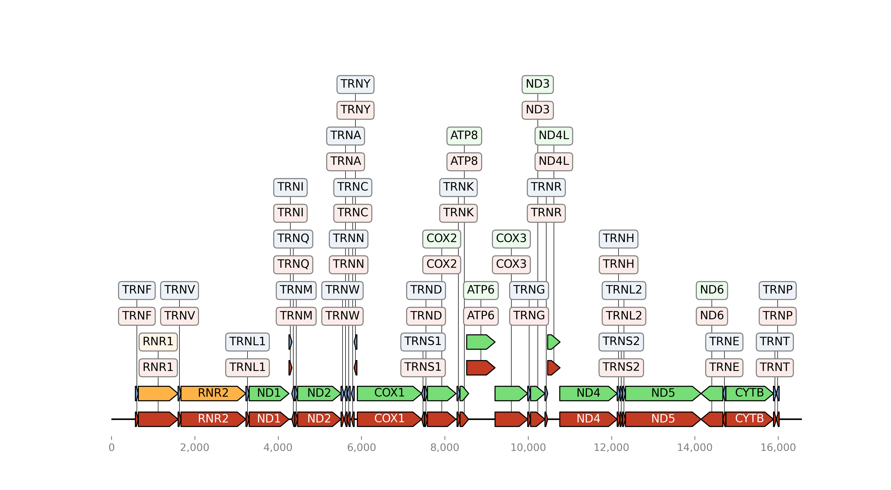

# bio-portfolio
Мой первый биоинформатический проект — визуализация митохондриального генома Homo sapiens
#Анализ митохондриального генома Homo sapiens

## Описание
В этом проекте я провёл аннотацию и визуализацию митохондриального генома человека на основе файла GenBank. Это мой первый шаг в биоинформатике и портфолио.

## Используемые технологии
- Python
- Biopython
- Pandas
- dna_features_viewer
- Jupyter Notebook

## Что сделано
- Загрузка GenBank-файла генома
- Извлечение аннотированных генов (CDS, tRNA, rRNA)
- Создание таблицы с координатами и направлениями
- Построение кольцевой карты генома

## Структура проекта
mitogenome-analysis/
├── data/
├── notebooks/
├── results/
└── README.md
## Результаты

## Автор
Касымов Фёдор 
Готовлюсь стать профессиональным биоинформатиком   
Telegram: @Zibiru  
